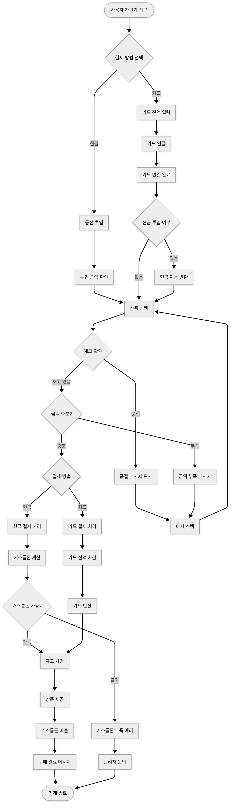

# Vending Machine

자판기 시뮬레이터입니다. 실제 자판기의 동작을 모방하여 현금 및 카드 결제, 상품 구매, 거스름돈 반환 기능을 구현했습니다.

## 사용한 기술 스택

- **Frontend**: React 18 + TypeScript
- **빌드 도구**: Vite
- **스타일링**: Tailwind CSS
- **라우팅**: React Router DOM
- **상태 관리**: Custom Store

## 프로젝트 구조

```
src/
├── core/                        # 핵심 로직
│   ├── services/               # 비즈니스 서비스
│   │   ├── cash.service.ts         # 현금 관리
│   │   ├── payment.service.ts      # 결제 처리
│   │   └── product.service.ts      # 상품 관리
│   ├── store/                  # 상태 관리
│   │   └── vending-store.ts        # 메인 스토어
│   └── event-emitter.ts        # 이벤트 시스템
├── types/                       # 타입 정의
│   ├── coin.ts                     # 동전 타입
│   ├── result.ts                   # Result 패턴
│   └── vending-machine.ts          # 자판기 도메인 타입
├── ui/                          # UI 컴포넌트
│   ├── @shared/                # 공통 컴포넌트
│   │   ├── components/             # 재사용 컴포넌트
│   │   └── hooks/                  # 커스텀 훅
│   ├── vending-machine/        # 자판기 페이지
│   │   ├── page.tsx                # 메인 페이지
│   │   └── components/             # 자판기 전용 컴포넌트
│   └── admin/                  # 관리자 페이지
│       ├── page.tsx                # 관리자 페이지
│       └── components/             # 관리자 전용 컴포넌트
└── utils/                       # 유틸리티
    ├── coins.ts                    # 동전 상수
    ├── message.ts                  # 메시지 유틸
    ├── products.ts                 # 상품 상수
    └── seed.ts                     # 초기 데이터
```

## 시작하기

### 설치

```bash
# 의존성 설치
pnpm install

# 개발 서버 실행
pnpm dev

# 빌드
pnpm build
```

### 사용법

1. **브라우저에서 접속**: `http://localhost:5173`
2. **결제 방법 선택**:
   - 현금: 화면의 동전을 드래그하여 투입구에 드롭
   - 카드: 카드 잔액 입력 후 연결
3. **상품 선택**: 원하는 음료수 클릭
4. **거스름돈 확인**: 하단에 거스름돈 정보 표시

## 아키텍처 특징

### 모듈화와 비지니스 로직 분리
프로젝트는 기능별로 명확히 분리된 모듈 구조를 가지고 있습니다:

- **Core**: 비즈니스 로직과 상태 관리
- **UI**: React 컴포넌트와 페이지
- **Types**: TypeScript 타입 정의
- **Utils**: 공통 유틸리티와 상수

### 독립적인 관심사 분리
각 도메인별로 독립적인 서비스를 구성하여 관심사를 분리했습니다:

- `ProductService`: 상품 관리 및 재고 처리
- `CashService`: 현금 관리 및 거스름돈 계산
- `PaymentService`: 결제 프로세스 통합 관리

### 정상 케이스
- 충분한 금액으로 상품 구매 (현금/카드)
- 정확한 금액으로 상품 구매 (거스름돈 없음)
- 현금 투입 후 카드 연결 (자동 현금 반환)
- 관리자 페이지에서 재고/현금고 관리

### 예외 케이스
- 금액 부족 상황 처리
- 재고 부족 상품 선택 시도
- 거스름돈 부족 상황 (관리자 안내)
- 카드 30초 타임아웃 처리
- 투입 금액 취소/환불 처리
- 현금고 동전 부족 경고

### 엣지 케이스
- 카드 연결 상태에서 동전 투입 시도 (차단)
- 품절 상품 선택 시도 (차단)
- 관리자에서 음수 재고 설정 시도 (차단)

### FLOWCHART
